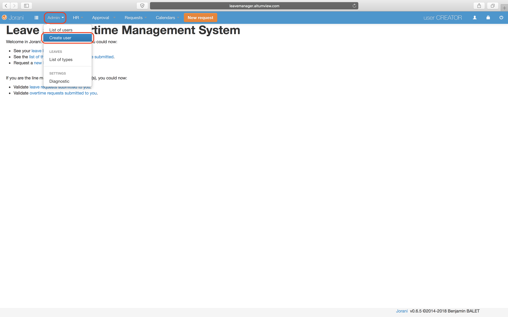
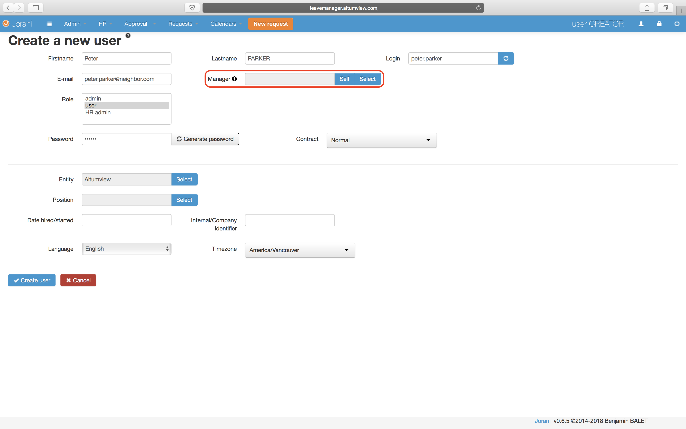
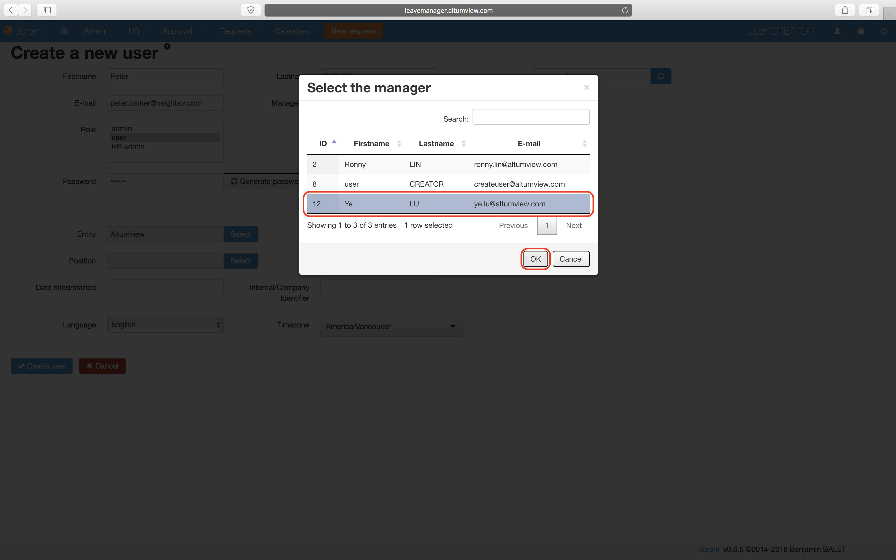

# How to use the new leave tracker
Follow these steps to start using the leave tracker to request time offs. The code is from an open source project so some functionalities may not feel complete. 
 1. [Set up your account](#Setup)
 2. [Use your account to request a time off](http://example.com/)
 3. [Navigate the calendar](http://example.com/) 

## <a name="Setup"></a> Set up your account

 1. Go to the [leave tracker website](http://leavemanager.altumview.com/jorani) and sign in using these credentials:
```
Login: user.creator 
Password: 12345
```

 2. Open the Admin dropdown from the top and click Create user. 
 3. Before filling in other details, click the select button for Manager. 
 4. Select Dr.Lu's account and click OK. 
 5. Fill in the other fields,


<!--stackedit_data:
eyJoaXN0b3J5IjpbNzEwMTA5ODI4LC0xMDUyMjA0OTQwLDE4ND
czNjY2MjQsMTU5NDk0NjE4NCwtNjAzODczMTAsLTExMjI1NzMz
MTYsNTI1ODY2NjE2LC01MzE2MTUyODMsLTUxMDk0NDI2NCwtMT
U5OTkxNjAyMSw4NjkzMjMyNDZdfQ==
-->