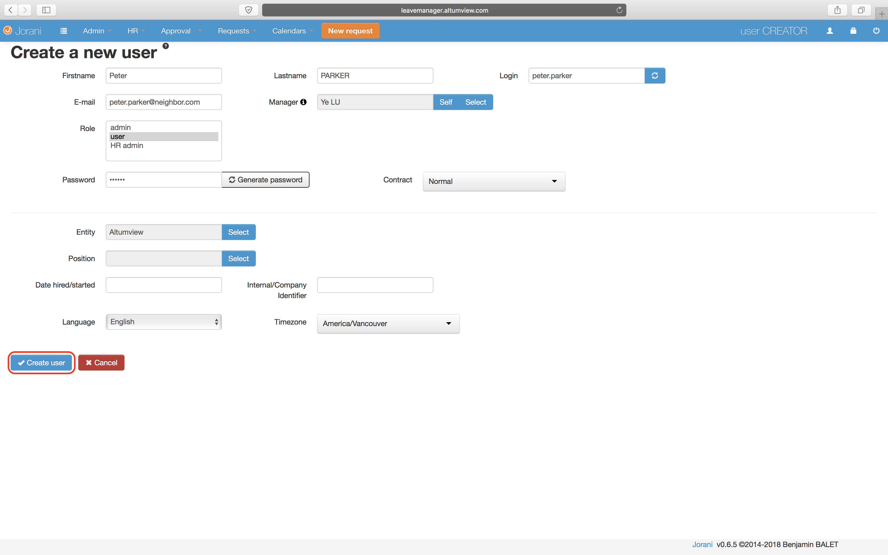

# How to use the new leave tracker
Follow these steps to start using the leave tracker to request time offs. The code is from an open source project so some functionalities may not feel complete. 
 1. [Set up your account](#Setup)
 2. [Use your account to request a time off](#Request)
 3. [Navigate the calendar](http://example.com/) 

## <a name="Setup"></a> Set up your account

 1. Go to the [leave tracker website](http://leavemanager.altumview.com/jorani) and sign in using these credentials:
```
Login: user.creator 
Password: 12345
```

 2. Open the Admin dropdown from the top and click Create user. 

 3. Before filling in other details, click the Select button for Manager. 

 4. Select Dr.Lu's account and click OK. 

 5. For the following fields, set them as follows:
```
Firstname: Your first name
Lastname: Your last name
Login: This field is automatically generated
E-mail: The email address that will receive notifications about your time off requests
Role: user 
Contract: Normal
Entity: Altumview.
Password: Something that you can remember but is not associated with your other passwords because the connection used by this website is not encrypted. 
```
 6. Click Create user to finish this step. 

## <a name="Request"></a>Request a time off


<!--stackedit_data:
eyJoaXN0b3J5IjpbMTQ2Mzc1MDY5Miw3NTU3MjcwODYsLTEwNT
IyMDQ5NDAsMTg0NzM2NjYyNCwxNTk0OTQ2MTg0LC02MDM4NzMx
MCwtMTEyMjU3MzMxNiw1MjU4NjY2MTYsLTUzMTYxNTI4MywtNT
EwOTQ0MjY0LC0xNTk5OTE2MDIxLDg2OTMyMzI0Nl19
-->