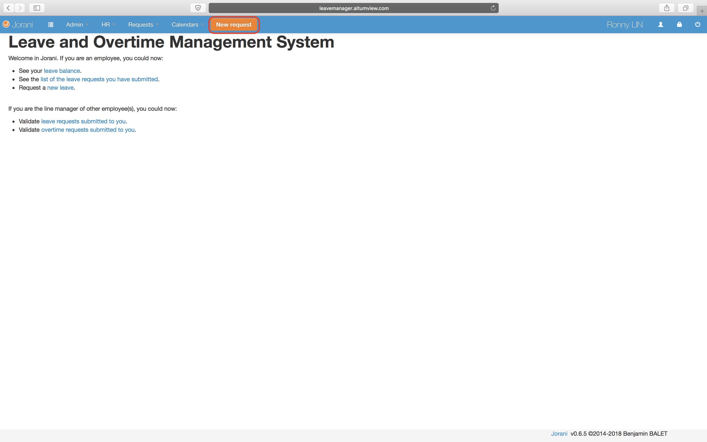
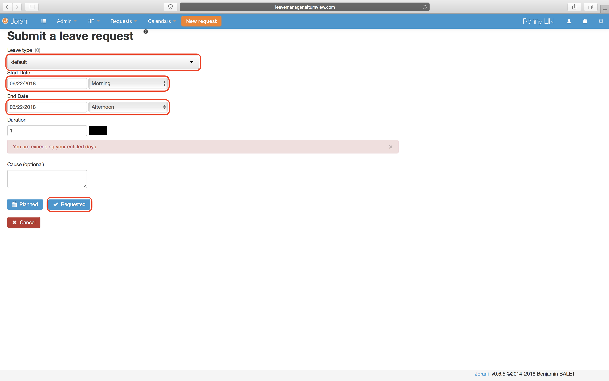

# How to use the new leave tracker
Follow these steps to start using the leave tracker to request time offs. The code is from an open source project so some functionalities may not feel complete. 
 1. [Use your account to request a time off](#Request)
 2. [Change your password](#pass) 

##  Request a time off

 1. Go to the [leave tracker website](http://leavemanager.altumview.com/jorani) and sign in.
 2. Click on New request. 
 3. For Leave type, you can choose default. Then choose the Start and End dates. You can select Morning or Afternoon.

> Note: You can ignore the about exceeding your entitled days.
 4. Optional: Type in a description for the time off request.
 5. Click Requested. Dr.Lu will receive a notification about the request. You will receive the notification after Dr.Lu has managed the request.
 
 ##  Request a time off

<!--stackedit_data:
eyJoaXN0b3J5IjpbMTU0NTIwMTk1MSwtMTc2NDE4NDA1NSwtOT
gxNDQwMjMyLDE2MTUxMTU2NCwxNDYzNzUwNjkyLDc1NTcyNzA4
NiwtMTA1MjIwNDk0MCwxODQ3MzY2NjI0LDE1OTQ5NDYxODQsLT
YwMzg3MzEwLC0xMTIyNTczMzE2LDUyNTg2NjYxNiwtNTMxNjE1
MjgzLC01MTA5NDQyNjQsLTE1OTk5MTYwMjEsODY5MzIzMjQ2XX
0=
-->