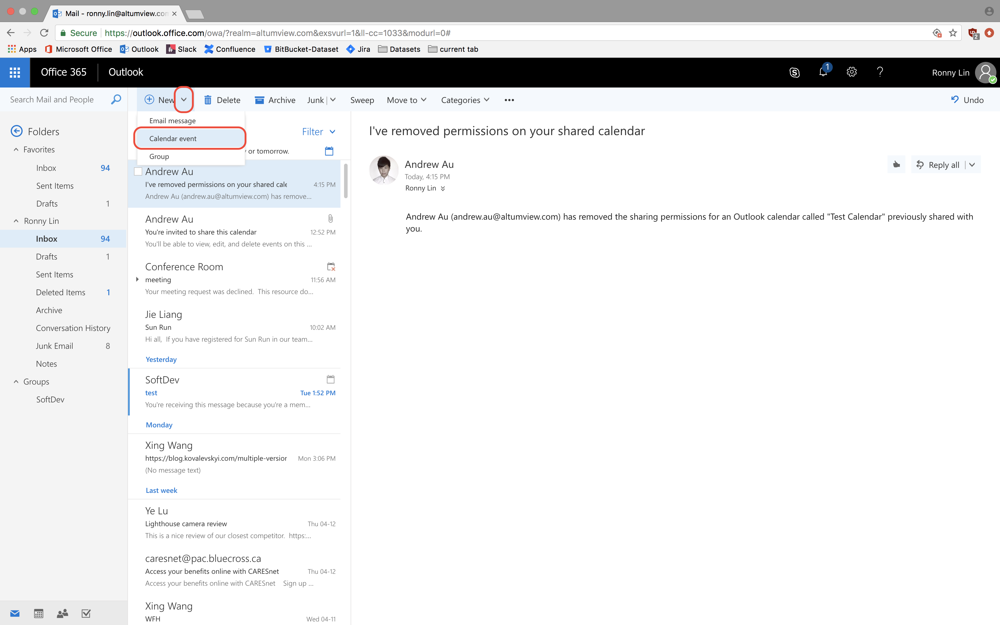
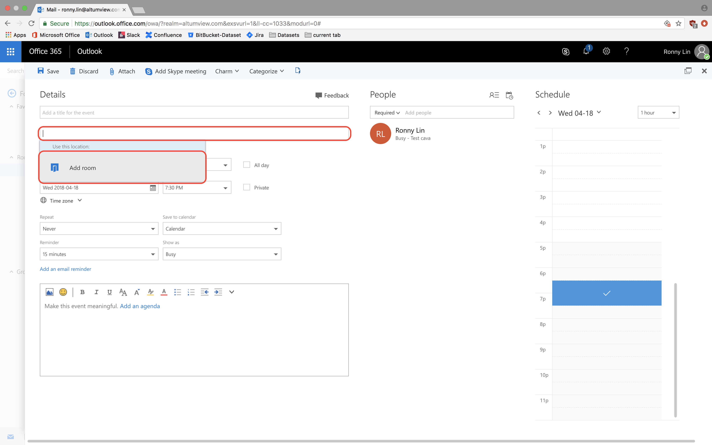

## Instructions for booking time off

 1. Open and log in to your company Outlook email account.
 2. Create a new calendar event. 
 3. Click on the location field and click Add room. 
 4. Click All rooms and select Vacation. 
 5. Add a title and choose the start and end dates. You can also add a description at the bottom. 
 6. Click send. Dr. Lu will receive a notification about the request. You will receive a notification after Dr. Lu has managed the request. 
 
 
 # To view the vacation calendar
 
 1. After accepting the calendar share from Vacation. You can view its calendar by clicking it under People's calendars.

 

<!--stackedit_data:
eyJoaXN0b3J5IjpbMTEwNTk3NzY3Myw4OTE1NDkwMjAsLTE4ND
g4NjgwNzYsLTE5NzkwNTEyODUsNzM3MTI5NDY1LDE4MjU2NzYy
NDddfQ==
-->