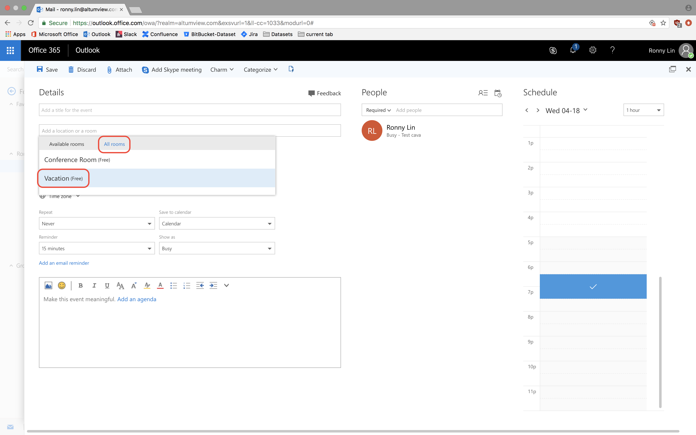
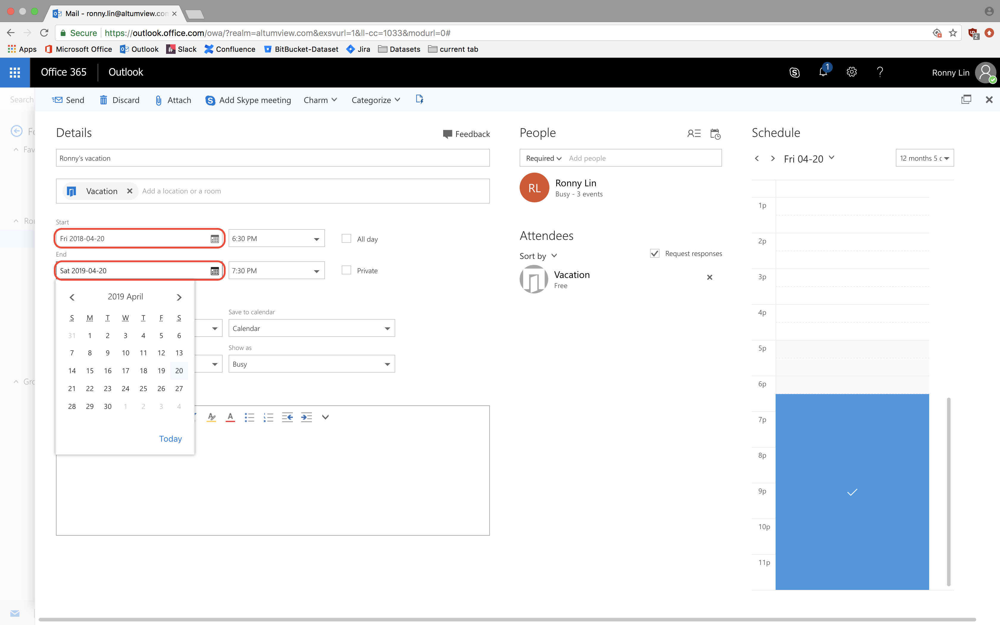
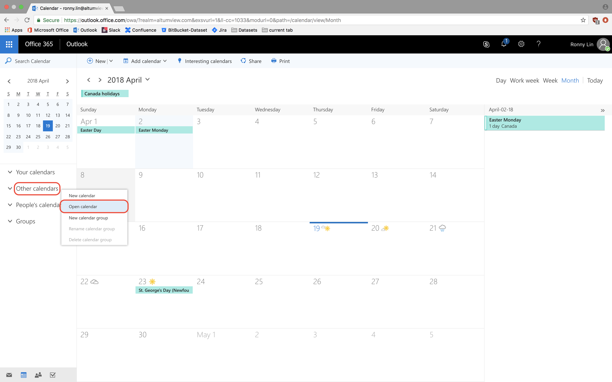
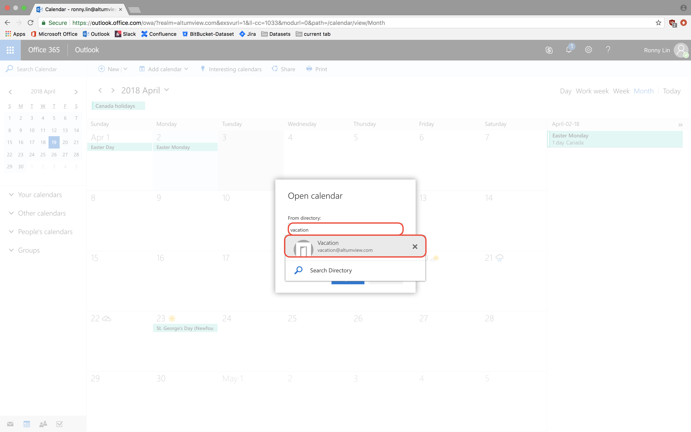

## Instructions for booking time off

 1. Open and log in to your company Outlook email account.
 2. Create a new calendar event. 
 3. Click on the location field and click Add room. 
 4. Click All rooms and select Vacation. 
 5. Add a title and choose the start and end dates. You can also add a description at the bottom. 
 6. Click send. Dr. Lu will receive a notification about the request. You will receive a notification after Dr. Lu has managed the request. 
 
## To view the vacation calendar
 1. Go to your Calendar app.
 2. Right click Other calendars or People's calendars and select open calendar. 
 3. Type in vacation@altumview.com in the directory field or select it from the dropdown and click Open.

 

<!--stackedit_data:
eyJoaXN0b3J5IjpbLTEyMjI5Mjk3MjYsMTIwMjYwNTAwOCwtND
M5MDA0ODU4LC05NzAwOTU3NzcsLTg5NDUwOTM0LDg5MTU0OTAy
MCwtMTg0ODg2ODA3NiwtMTk3OTA1MTI4NSw3MzcxMjk0NjUsMT
gyNTY3NjI0N119
-->