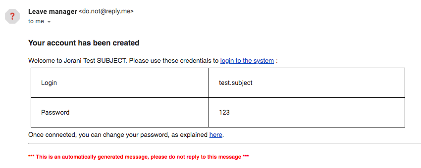

# How to use the new leave tracker
Follow these steps to start using the leave tracker to request time offs. The code is from an open source project so some functionalities may not feel complete. 
 1. [Use your account to request a time off](#Request)
 2. [Change your password](#Pass) 

##  Request a time off

 1. Go to the [leave tracker website](http://leavemanager.altumview.com/jorani) and sign in. If this is the first time signing in, use the credentials that are sent to you in an email. It should look like the following: 
 2. Click on New request. 
 3. For Leave type, you can choose default. Then choose the Start and End dates. You can select Morning or Afternoon.

> Note: You can ignore the part about exceeding your entitled days.
 4. Optional: Type in a description for the time off request.
 5. Click Requested. Dr.Lu will receive a notification about the request. You will receive the notification after Dr.Lu has managed the request.
 
##  Change password
 1. Go to the [leave tracker website](http://leavemanager.altumview.com/jorani) and sign in.
 2. Click on the Lock icon at the top right. 
 3. Type in your password and Click Reset.
> Note: Choose a password that you can remember but is not associated with your other passwords because the connection is not encrypted. 

<!--stackedit_data:
eyJoaXN0b3J5IjpbMzEyMTU1OTEzLDU4MzIwMTQwMCwtMjAxNz
k2NjY5NiwtMTY0NzI0OTYwMywtMTc2NDE4NDA1NSwtOTgxNDQw
MjMyLDE2MTUxMTU2NCwxNDYzNzUwNjkyLDc1NTcyNzA4NiwtMT
A1MjIwNDk0MCwxODQ3MzY2NjI0LDE1OTQ5NDYxODQsLTYwMzg3
MzEwLC0xMTIyNTczMzE2LDUyNTg2NjYxNiwtNTMxNjE1MjgzLC
01MTA5NDQyNjQsLTE1OTk5MTYwMjEsODY5MzIzMjQ2XX0=
-->