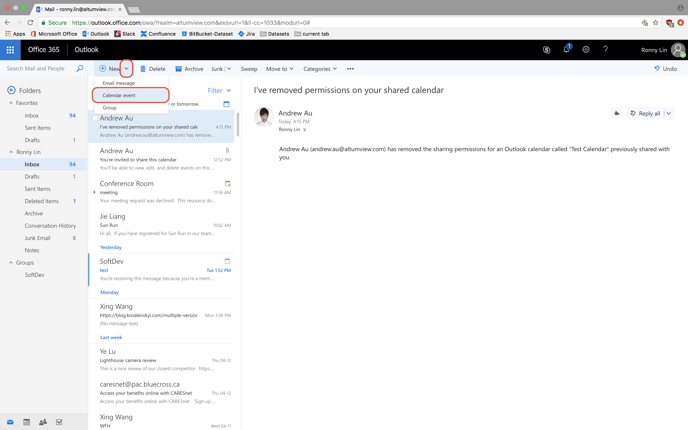
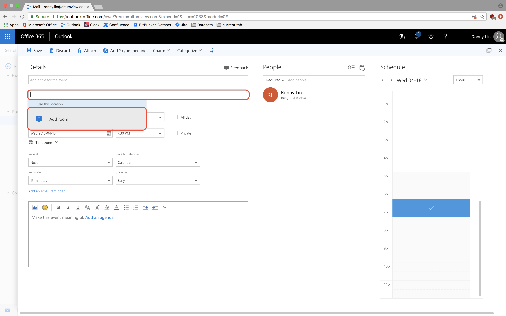
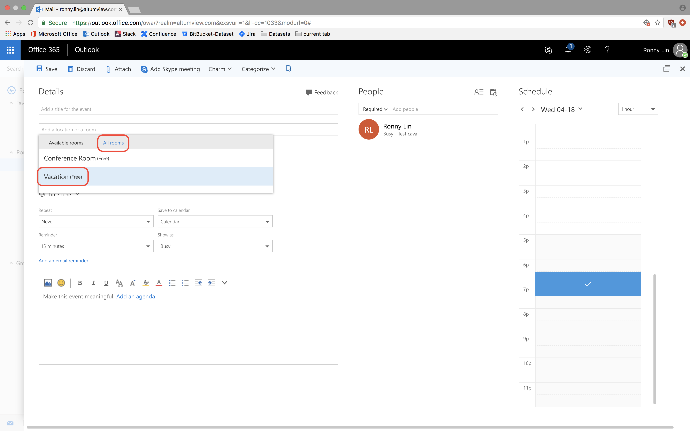
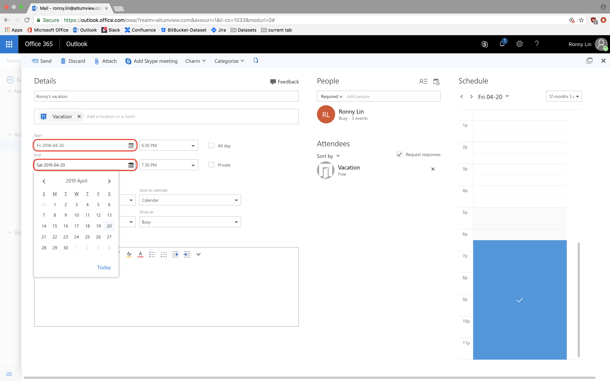

## Instruction for booking time off

 1. Open and log in to your company Outlook email account.
 2. Create a new calendar event. 
 3. Click on the location field and click Add room. 
 4. Click All rooms and select Vacation. 
 5. Add a title and choose the start and end dates. You can also add a description at the bottom. 
 6. Click send. 

<!--stackedit_data:
eyJoaXN0b3J5IjpbMTMxMjMzMjIxOCwtNDIyNjc0NTU0LDk3MD
Q2Nzg5XX0=
-->